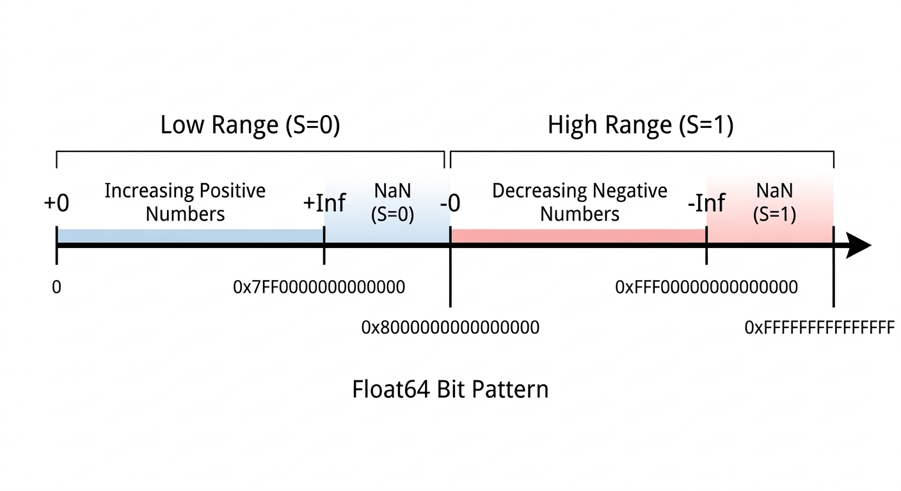

# 有趣的 Float64

## 1. Float64 的二进制表示

IEEE 754双精度浮点数（Go中的float64）由64位组成：

这64位从高到低分为三部分：

| 组成部分 | 位宽（Bits） | 范围 | 功能 |
| --- | --- | --- | --- |
| 符号位 （Sign） | 1 bit | 第 63 位 | 决定正负（0 为正，1 为负） |
| 阶码 （Exponent） | 11 bits | 第 62\~52 位 | 决定数值的范围（指数部分） |
| 尾数 （Fraction/Mantissa） | 52 bits | 第 51\~0 位 | 决定数值的精度（有效数字） |

### 符号位S

- S = 0 表示正数
- S = 1 表示负数

### 阶码（指数）E

为了表示负指数，IEEE 754使用偏移量（Bias）来表示实际的指数值。对于float64，偏移量是0x3FF（1023），因此实际指数`e`=`E-1023`。这样一来，浮点数的指数部分E在存储时无需使用符号位来表示正负，进而节省了一个位。

作为一个11位的无符号整数，`E`的物理取值范围是0～0x7FF（2047）。减去偏移量后，实际的指数`e`的范围是-1023～1024。偏移量`0x3FF`=`0x7FF>>1`，即`E`最大值的一半。

### 尾数M

把一个数值表示为 $1.bbb…×2^e$ 的形式（`1.bbb…`是一个二进制小数，`b`为二进制位，0或1），去掉开头的`1.`，剩余的`bbb…`部分即尾数`M`，如果尾数不足52位，末尾补0。

因此尾数`M`代表的小数值为 $M×2^{-52}$ ，即按照二进制规则把`M`的小数点向左移动52位。

### 正规数（Normal numbers）

在把一个数值表示为上述 $1.M × 2^e$ 的形式时，如果指数`e`>=-1022（即`E` >= 1），则称该数值为正规数。正规数的整数部分永远为1，无需存储在浮点数中，进而节省一个位。

正规数代表的值可通过如下公式计算得出：

$(-1)^S × (1 + M×2^{-52}) × 2^{E-1023}$

绝对值最小的正规数是当`S`=0、`E`=1且`M`=0时的上述值，即 $1.0×2^{-1022}$ ，约等于 $2.2250738585072014×10^{-308}$ 。

如果只用正规数来表示浮点数，则在向0靠近的过程中会在绝对值为 $1.0×2^{-1022}$ 处突然变为0，导致数值的表示不连续且无法表示绝对值比它更小的数值。

### 次正规数（Subnormal numbers）

次正规数是绝对值小于 $1.0×2^{-1022}$ 的浮点数。IEEE 754标准规定，次正规数的指数部分`E`固定为0，代表的实际指数`e`=`-1022`（此处`e`的计算不再遵守`E-1023`）；次正规数的尾数`M`直接表示小数部分 $M×2^{-52}$ （此处也不再有隐含的整数部分1）。

次正规数代表的值可通过如下公式计算得出：

$(-1)^S × M×2^{-52} × 2^{-1022}$

即

$(-1)^S × M×2^{-1074}$

绝对值最小的次正规数为 $2^{-1074}$ ，约等于 $4.9406564584124654×10^{-324}$ ；绝对值最大的次正规数为 $(1.0-2^{-52})×2^{-1022}$ ，约等于 $2.225073858507201×10^{-308}$ ，和绝对值最小的正规数非常接近，相差一个ULP。

### Float64的特殊值

- 当一个float64的阶码`E`和尾数`M`都为0时，表示的数值为0，此时符号位`S`决定了是+0还是-0。

- 当一个float64的阶码`E`为0x7FF（全是1）且尾数`M`为0时，表示的数值为无穷大（Infinity），此时符号位`S`决定了是+∞ 或 -∞。

- 当一个float64的阶码`E`为0x7FF（全是1）且尾数`M`不为0时，表示的数值为非数（NaN，Not a Number），此时符号位`S`通常被忽略。Float64中一共有 $2 × (2^{52}-1)$ （大约 $9 × 10^{15}$ ）种NaN表示形式。

## 2. 生成和解析 Float64

### 生成 Float64

要把一个实数转换为float64的二进制表示，可以按照以下步骤进行：

1. **确定符号位S**：如果实数是正数，`S`=0；如果实数是负数，`S`=1。

2. **计算绝对值**：取实数的绝对值，记为`x`。

3. **把整数部分转换为二进制**：使用初2求余法把`x`的整数部分转换为二进制，得到一个二进制整数。

4. **把小数部分转换为二进制**：使用乘2取整法把`x`的小数部分转换为二进制，得到一个二进制小数。

5. **规范化**：把整数部分和小数部分组合成一个二进制数，并把它规范化成 $1.M × 2^e$ 的形式，得到尾数`M`和实际指数`e`。

6. **组合成Float64**：将符号位`S`、阶码`E`和尾数`M`按照IEEE 754的格式组合成一个64位的二进制数，即为实数的float64表示。

例如， $-26.375$ ：

1. `S`=1（负数）

2. `x`=26.375

3. 整数部分26转换为二进制：`11010`

4. 小数部分0.375转换为二进制：`0.011`（0.375×2=0.75取整0，0.75×2=1.5取整1，0.5×2=1取整1）

5. 组合成二进制小数`11010.011`，规范化为 $1.1010011 × 2^4$ 。实际指数`e`=4，此数为正规数，于是`M`=0b10100110……（去掉开头的`1.`，末尾补0）、`E`=e+1023=4+1023=1027。

6. 组合成Float64：`S`=1，`E`=0b10000000011，`M`=0b1010011000000000000000000000000000000000000000000000。最终的二进制表示为：

| S | E | M |
| --- | --- | --- |
| 1 | 10000000011 | 1010011000000000000000000000000000000000000000000000 |

即0xC03A600000000000。

如果第5步规格化后得到的实际指数`e`小于-1022，则该数值为次正规数。此时阶码`E`必须固定为0，然后按照实际指数`e`=-1022来计算尾数`M`。

### 解析 Float64

例如，0x3ffc000000000000，按照Float64的二进制表示形式解析，得到`S`=0，`E`=0x3FF（1023），`M`=0xC000000000000。

`E`不为0，此数值为正规数，根据上述正规数求值公式计算：

$(-1)^S × (1 + M×2^{-52}) × 2^{E-1023}$

= $(-1)^0 × (1 + 0xC000000000000 × 2^{-52}) × 2^{1023-1023}$

= $(-1)^0 × (1 + 0xC × 2^{48} × 2^{-52}) × 2^{0}$

= $1 + 0xC × 2^{-4}$

= $1 + 12 ÷ 16$

= $1 + 0.75$

= $1.75$

如果按照按照Float64的二进制表示形式解析得到的阶码`E`为0且尾数`M`不为0，则该数值为次正规数，需根据上述次正规数求值公式来计算float64的值。

### 舍入至最近，等距取偶规则（Round to Nearest, Ties to Even）

当一个实数无法精确表示为float64时，需要一个舍入规则来处理超出float64精度范围的部分。IEEE 754标准规定的默认舍入模式是“舍入至最近，等距取偶”。

在这种舍入模式下，如果一个实数的精确值在两个可表示的float64之间，则选择距离更近的那个float64；如果距离两个可表示的float64的距离相等，则选择尾数部分为偶数的那个float64。这个规则可类比为：

把尾数的前52位记作`L`，把实际尾数中`L`后面的部分记作`R`：

- 如果二进制小数`0.R`<二进制`0.1`，舍去`R`；
- 如果`0.R`>`0.1`，则在L上加1；
- 如果`0.R`=`0.1`，看L的最低位：
  - 如果最低位是1（奇数）则在L上加1，使`L`变为偶数；
  - 如果最低位是0（偶数）则舍去`R`。

例如，实数0.1转换为二进制并规格化后为 $1.1001100(1100循环) × 2^{-4}$ 。转换为float64时，`L`为……110011001，`R`为1001100……因此`0.R`=0.1001100……>0.1，所以在`L`上加1，最终得到尾数部分为……110011010。

在实际的软硬件实现中，此规则可通过如下方式实现：

首先把最后保留位记作`L`，把最后保留位后面的第一位记作`G`（Guard bit），把最后保留位后面的第2位记作`R`（Round bit），把最后保留位后面第3位及以后的部分记作`S`（Sticky bit）。

- 如果`G`=0，则舍去`L`后面的部分；
- 如果`G`=1且（`R`=1或`S`=1），则进位；
- 如果`G`=1且`R`=0且`S`=0，则看`L`：
  - 如果`L`=1（奇数）则进位；
  - 如果`L`=0（偶数）则舍去`L`后面的部分。

在运算过程中需要将所有超出`R`位之后的低位进行逻辑或运算，以得到`S`位的值。

## 3. Float64的一些性质

### 位模式与数值的关系

因为float64使用64个二进制位来存储，所以任何一个float64数值都可以唯一地映射到一个64位无符号整数上，反之亦然。这个64位无符号整数被称为float64的位模式（bit pattern）。通过对float64的位模式进行分析，可以得到一些关于float64数值分布和精度的有趣结论。

由于符号位`S`位于最高位，因此整个uint64的取值范围被分为两半：低位区间0～0x7FFFFFFFFFFFFFFF和高位区间0x8000000000000000～0xFFFFFFFFFFFFFFFF。低位区间中依次包含+0、正数、+Inf和符号位为0的NaN；高位区间中依次包含-0、负数、-Inf和符号位为1的NaN。

随着位模式的增大，float64在数轴上的排列为0、依次递增的正数（0\~0x7FEFFFFFFFFFFFFF）、+Inf（0x7FF0000000000000）、符号位为0的NaN（0x7FF0000000000001\~0x7FFFFFFFFFFFFFFF）、-0（0x8000000000000000）、依次递减的负数（0x8000000000000001\~0xFFEFFFFFFFFFFFFF）、-Inf（0xFFF0000000000000）和符号位为1的NaN（0xFFF0000000000001\~0xFFFFFFFFFFFFFFFF）。参看下图：

```text
┌-------- 低位区间(S=0) --------┼-------- 高位区间(S=1) --------┐

        正数             NaN           负数              NaN  
                       (S=0)         (逆序)            (S=1)
+0                 +Inf      -0                   -Inf
├-------------------┼---------┼--------------------┼---------┼->
0             0x7FF00000   0x80000000         0xFFF00000  0xFFFFFFFF
                00000000     00000000           00000000    00000000                          
```



### ULP（Unit in the Last Place）

ULP是指两个相邻的float64数值之间的差值的绝对值。ULP较小，表示在浮点数的分布较密集；ULP较大，表示浮点数的分布较稀疏。

对于一个给定的float64正规数 $x$ ，其ULP可以通过以下公式计算：

$ULP_{Normal}(x) = 2^{e - 52}$

其中 $e$ 是 $x$ 的实际指数。

此公式的推导过程如下：

假设一个正规数 $x1$ = $(-1)^S × (1 + M×2^{-52}) × 2^{e}$ ，则相邻的绝对值更大的正规数 $x2$ = $(-1)^S × [1 + (M+1)×2^{-52}] × 2^{e}$ ，因此：

$x2-x1$

$= (-1)^S × [1 + (M+1)×2^{-52}] × 2^{e} - (-1)^S × (1 + M×2^{-52}) × 2^{e}$

$= [(-1)^S × 2^e ] × [1 + (M+1)  ×  2^{-52} - (1 + M  ×  2^{-52})]$

$= [(-1)^S × 2^e ] × [1 +  M × 2^{-52} + 2^{-52} - 1  - M × 2^{-52}]$

$= [(-1)^S × 2^e ] × 2^{-52}$

$= (-1)^S × 2^{e-52}$

那么， $|x2-x1| = 2^{e-52}$ ，即

$ULP_{Normal}(x) = 2^{e-52}$

从这个公式可以看出，指数相等的正规数ULP也相等。指数每增加1，ULP会翻倍；指数每减少1，ULP会减半。因此正规数在数轴上的排列密度随着数值的增加而变得越来越稀疏，随着数值的减少而变得越来越密集。

用类似的方法可以推导出次正规数的ULP为：

$ULP_{Subnormal}(x) = 2^{-1074}$

从这个公式可以看出次正规数的ULP是一个非常小的常数，这个值远远小于正规数的ULP。因此次正规数以远超正规数的密度分布在数轴上非常靠近0的狭小区间内。

### ULP距离

ULP距离是指两个float64数值之间的ULP数量。

对于两个非无穷大、非NaN的float64数值`f1`和`f2`，它们之间的ULP距离可以通过以下代码计算：

```go
// ulpDistance calculates the ULP distance between two float64 values.
func ulpDistance(f1, f2 float64) uint64 {
    var orderedBits = func(f float64) uint64 {
        u := math.Float64bits(f)
        if u&(1<<63) != 0 {
            return ^u
        }
        return u | (1 << 63)
    }

    if math.IsNaN(f1) || math.IsNaN(f2) || math.IsInf(f1, 0) || math.IsInf(f2, 0) {
        panic("can't calculate ULP distance for NaN or Inf")
    }

    a := orderedBits(f1)
    b := orderedBits(f2)
    if a >= b {
        return a - b
    }
    return b - a
}
```

这个算法的原理非常简单：使用`orderedBits()`函数把所有float64数值映射为单调递增的uint64值，然后通过计算两个uint64值的差值来得到它们之间的ULP距离。

`orderedBits()`函数的实现逻辑如下：

- 如果float64数值的符号位为1（负数），则对其位模式取反，使得所有负数依次映射到0～0x7FFFFFFFFFFFFFFF区间内，其中`-0`被映射到0x7FFFFFFFFFFFFFFF；

- 如果float64数值的符号位为0（正数），则把其最高位设置为1，使得所有正数都映射到0x8000000000000000～0xFFFFFFFFFFFFFFFF区间内，其中`+0`被映射到0x8000000000000000。

这两个映射中，第二个比较简单：正数的位模式本来就是单调递增的，把其最高位设置为1等于把它们在数轴上向右平移了0x8000000000000000个位置，仍然保持单调递增。

由于对一个`uint64`值取等价于从`uint64`的最大值0xFFFFFFFFFFFFFFFF中减去它，因此第一个映射相当于把所有负数在数轴上以位模式0为对称中心进行翻转。这样一来，映射后的负数从单调递减变为单调递增，并且与正数的映射结果在数轴上连续排列。翻转后的数轴如下图所示：

```text

   NaN           负数                   正数            NaN      
  (S=1)                                               (S=0)
        -Inf                  0                   +Inf
┼---------├-------------------┼--------------------┼---------┼->
0             0x7FF00000   0x80000000         0xFFF00000  0xFFFFFFFF
                00000000     00000000           00000000    00000000                          
```

这里面还有一个边界条件需要注意：`-0`被映射到0x7FFFFFFFFFFFFFFF，而`+0`被映射到0x8000000000000000，它俩之间的ULP距离为1而不是0。

### 绝对精度与相对精度

精度是衡量一个浮点数精确程度的指标。精度越小，代表该浮点数和相邻浮点数之间越密集；精度越大，代表该浮点数和相邻浮点数之间越稀疏。“精度”这个词有一点反直觉：精度值越小代表该浮点数的精确程度越高；精度值越大，代表该浮点数的精确程度越低。

“绝对精度”是指一个float64数值与其最接近的可表示的float64数值之间的差值的绝对值，这个值和ULP是等价的。次正规数的绝对精度是一个非常小的常数。正规数的绝对精度随着数值的增加而变得越来越大，随着数值的减小而变得越来越小。

“相对精度”是指一个float64数值与其最接近的可表示的float64数值之间的差值与该数值的绝对值之比，即ULP和该数值绝对值之比。

正规数的相对精度为

$RP_{Normal} = \frac{ULP_{Normal}}{|Value|} = \frac{2^{e-52}}{(1.f) × 2^e} = \frac{2^{-52}}{1.f}$

当尾数`f`为0时，相对精度达到最小值 $2^{-52}$ ；当`f`接近1时，相对精度接近最大值 $2^{-53}$ 。整体来看，正规数的相对精度基本恒定。

与此对应，次正规数的相对精度为

$RP_{Subnormal} = \frac{ULP_{Subnormal}}{|Value|} = \frac{2^{-1074}}{(0.f)×2^{-1074}} = \frac{1}{0.f}$

可见，次正规数的相对精度等于其自身的倒数。

### 容差比较法

对于正规数而言， $RP = \frac{2^{-52}}{1.f}$ ，其最小值为 $2^{-52}$ ，假设我们指定一个容差 $\epsilon = N × 2^{-52}$ ，那么

$\epsilon × |Value| = (N × 2^{-52}) × (ULP_{Value} × 1.f_{Value} × 2^{52}) = N × ULP_{Value} × 1.f_{Value}$

由于 $1.f_a \in [1, 2)$，因此

$N × ULP_{Value} ≤ （\epsilon × |Value|） < 2 × N × ULP_{Value}$ 。

于是 $\epsilon × \max (|a|, |b|)$ 的值在会永远落在 $ULP_a$ 和 $ULP_b$ 最大值的N倍和2N倍之间。

如果在比较两个正规数a和b是否足够接近时，指定一个相对容差 $\epsilon$ ，并让实际参与比较的容差值为 $\epsilon × \max (|a|, |b|)$ ，则无论a和b的大小如何，比较结果都能保持基本稳定。

但是当a和b中有一个（例如b）的绝对值趋近于0时，相对容差比较就变成判断 $|a-0| < \epsilon × \max (|a|, |0|)$ 是否成立。上述断言可简化为 $|a| < \epsilon × |a|$ ，即判断 $\epsilon > 1$ 是否成立，这显然是不合适的。此时相对容差比较法就失效了。

对于次正规数而言，由于它的的绝对精度是恒定的，所以绝对容差比较法更为合适。

综上所述，一个完整的浮点数比较法往往采用“绝对和相对混合容差法”。

### 二进制位数和十进制位数

n位二进制数字可以表示位多少位的十进制数字呢？其实就是求解如下以 $x$ 为未知数的方程：

$10^x = 2^n$

即

$x = n × \log_{10}(2)$

由于float64的尾数部分有52位，因此它的十进制有效位数为： $52 × \log_{10}(2) ≈ 15.6525$ 。
